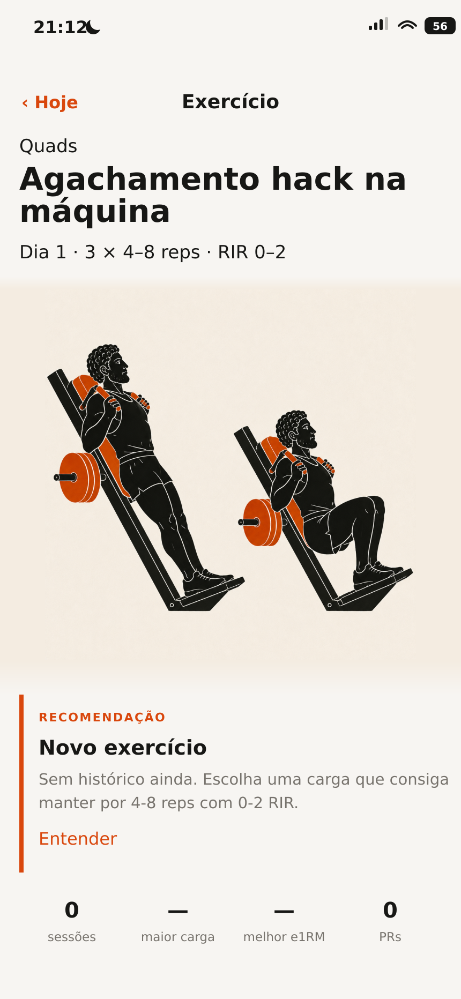

# Exercise detail illustration treatment

## Status and authority

- **Status:** approved design direction; implemented
- **Approved:** 2026-08-16
- **Amended:** 2026-08-17, during implementation, in two places marked
  **Amendment** below. Both came from measuring the shipped artwork rather than
  the single approved mock; the treatment, hierarchy and restraint are unchanged.
- **Applies to:** the exercise detail view (`#exercise` / `renderExerciseView()`)
- **Reference viewport:** iPhone-class, 430 CSS px wide

This document is the implementation source of truth for adding licensed
exercise artwork to the exercise detail page. It supersedes only the exercise
detail illustration, spacing, and summary-divider treatment in
[UI overhaul specification §3.5](./ui-overhaul-spec.md). All other application
tokens, interaction behavior, data semantics, and lower-page content remain as
specified today.

The approved mock is included below. It shows the no-history state in
Portuguese; layout and treatment are authoritative, while live localized copy
and values continue to come from the application.



## Objective

Show the movement illustration where a user reads an exercise's prescription,
recommendation, and history. The artwork should feel native to the editorial
page—not like a card, thumbnail, or pasted square—and should make the movement
recognizable without competing with the exercise name.

## Scope

This treatment:

- uses the exercise's existing licensed `media` asset and its sampled
  `mediaBg` paper colour;
- inserts the illustration between exercise metadata and the recommendation;
- gives the art a full content-column field with a vertical transition between
  its warm cream background and the unchanged app background;
- removes neutral dividers from the title/art/recommendation/summary cluster;
- keeps the orange recommendation rail as the single structural accent; and
- works for both empty-history and populated-history exercise pages.

It does **not**:

- add, edit, crop, recolor, filter, or regenerate exercise artwork;
- invent a placeholder for exercises without licensed media;
- change recommendations, progression calculations, charts, records, sessions,
  navigation, storage, localization, or service-worker asset coverage;
- add a card surface, border, radius, shadow, caption, carousel, or media action;
- remove rules from unrelated components or from lower-page history content.

## Visual contract

### Page hierarchy

The upper page renders in this order:

1. existing back control and centered page title;
2. primary muscle, exercise name, and prescription metadata;
3. full-width illustration field;
4. recommendation, retaining its orange vertical rail;
5. four summary metrics with no enclosing or internal rules;
6. the existing progression, records, and recent-session content.

The art is a quiet instructional pause between prescription and guidance. The
exercise name remains the strongest text on the page.

### Background and gradient

- Leave `body` and `main` on `var(--bg)` (`#F4F2EF`). Do not change the page
  background to match the illustration.
- Set a local `--exercise-art-bg` on the media field from the paper colour of
  **that movement's own artwork**.

  > **Amendment (2026-08-17).** This was specified as one token,
  > `--exercise-art-bg: #F4ECE1`, sampled from the approved mock's source
  > artwork. Measuring the empty border ring of all 96 shipped illustrations
  > showed that value is not representative: the set spans `#E3D4BE` to
  > `#F4EDE1`, only 5 of 96 sit within 5 levels of it, and 69 sit at 13 or more.
  > Since the field bleeds full-width behind an 80 %-wide picture, that distance
  > draws as a hard vertical edge down both sides of the square — the pasted tile
  > this treatment exists to avoid — on 91 of the 96 movements. No constant fixes
  > it: re-sampling from the library median only moves the failure onto the hero
  > exercise. The colour therefore travels with the movement, sampled per file by
  > `tools/sample-media-bg.mjs` and carried as `mediaBg` on the library entry.
  > The field is now at most 1 level from its artwork's paper across the library.
  > The artwork itself is untouched.

- Transition vertically from `var(--bg)` into `--exercise-art-bg`, hold the warm
  field behind the useful illustration area, then transition back to
  `var(--bg)`. The target profile is:

  ```css
  linear-gradient(
    to bottom,
    var(--bg) 0,
    var(--exercise-art-bg) var(--exercise-art-lead),
    var(--exercise-art-bg) calc(100% - var(--exercise-art-trail)),
    var(--bg) 100%
  )
  ```

  > **Amendment (2026-08-17).** The stops were specified as `10%` / `88%`. A
  > percentage stop scales with the field's height, so the fade did not land on
  > the empty bands above and below the picture: at the 560 px shell it climbed
  > roughly 30 px back over the artwork and redrew the very edge it exists to
  > dissolve. The stops are now the lengths of those bands, which holds the warm
  > field behind the illustration at every width — what this paragraph asks for
  > in prose.

- The fade is a color bridge between two near-neutral backgrounds, not a glow,
  shadow, vignette, spotlight, or decorative gradient. This is the sole scoped
  exception to the general “no gradients” direction in the UI overhaul spec;
  it does not authorize gradients elsewhere.
- If edge veils are needed to hide the opaque image's top and bottom boundary,
  keep them inside the artwork's empty background. They must not fade, blur, or
  recolor the lifter, machine, plates, or orange details.

### Width and composition

- The field bleeds through `main`'s horizontal padding to the edges of the
  app's `--maxw` column. On a phone it therefore reaches the viewport edges; on
  a wider display it remains inside the centered app shell.
- Account for the two safe-area paddings independently rather than assuming
  equal left and right insets:

  ```css
  margin-left: calc(-1 * max(16px, env(safe-area-inset-left)));
  margin-right: calc(-1 * max(16px, env(safe-area-inset-right)));
  ```

- Center the complete square asset and show it uncropped at approximately 80%
  of the field width, capped near 450 px: `width: min(80%, 450px)`.
- Preserve the intrinsic 1:1 ratio. Use `display: block; height: auto;` and the
  supplied `width="768" height="768"` hints.
- Keep enough vertical breathing room that neither figure touches the title or
  recommendation. The reference uses roughly 12–20 px above and 24–32 px below
  the centered image at phone widths.

### Separation and dividers

Do not draw neutral horizontal or vertical lines:

- above or below the illustration;
- between the illustration and recommendation;
- around the recommendation; or
- around or between the four summary metrics.

Use whitespace, typography, and the gradient transition for grouping. Keep the
existing 3 px orange recommendation rail. Divider removal must be scoped to the
exercise-detail summary so shared `.statrow`, `.metric`, and history styles do
not change elsewhere.

## Rendering contract

- Resolve media from the same exercise identity already used by the detail view:
  `exerciseMedia(exRef)`.
- Render the media block only when that helper returns a real URL.
- Insert it after `.exdet__meta` and before `.recblock`.
- Use the existing localized `preview.art_alt` string with the displayed
  exercise name. The image communicates movement form and therefore needs a
  descriptive alt, unlike decorative list thumbnails.
- Use `decoding="async"`; do not use `loading="lazy"` for this above-the-fold
  image.
- Do not emit an empty ``, broken URL, blank tile, or placeholder when
  media is absent. The metadata should flow directly into the recommendation.
- Do not make the artwork clickable or focusable.

## Required states

| State | Expected result |
|---|---|
| Licensed program exercise, no history | Illustration appears; new-exercise recommendation and zero metrics remain intact. |
| Licensed exercise with history | Same illustration treatment; recommendation, metrics, chart, records, and sessions use live data. |
| Historical licensed exercise | Recovered exercise identity supplies the illustration when its mapped media is available. |
| Built-in or custom exercise without media | No illustration block and no reserved blank height. |
| English / Portuguese | Identical geometry; localized name and descriptive alt text. |
| kg / lb | Identical geometry; only existing metadata and metric values change. |

## Responsive and accessibility requirements

- Verify 320, 360, 390, and 430 px phone widths plus the centered 560 px app
  shell. The asset must remain complete and must never cause horizontal scroll.
- Maintain the source art's aspect ratio and visible two-position composition.
- Keep title, recommendation, and stat text at the existing accessible contrast;
  the gradient carries no meaning and requires no additional announcement.
- The image must have a localized, non-empty `alt`; its wrapper must not add a
  landmark or interactive semantics.
- Width and height attributes must reserve space before decode to prevent layout
  shift.

## Acceptance criteria

The design is complete when:

- a mapped exercise shows exactly one complete illustration in the approved
  position and proportions;
- its warm background dissolves into the unchanged page background at both
  vertical edges without a visible hard rectangle;
- the title/art/recommendation/summary area contains no neutral divider lines;
- the orange recommendation rail remains crisp and is the only line in that
  cluster;
- an unmapped/custom exercise renders no media element and no empty media gap;
- neither the shared exercise artwork files nor unrelated stat/history styles
  change; and
- phone and 560 px shell screenshots match the hierarchy and restraint of the
  approved mock.
