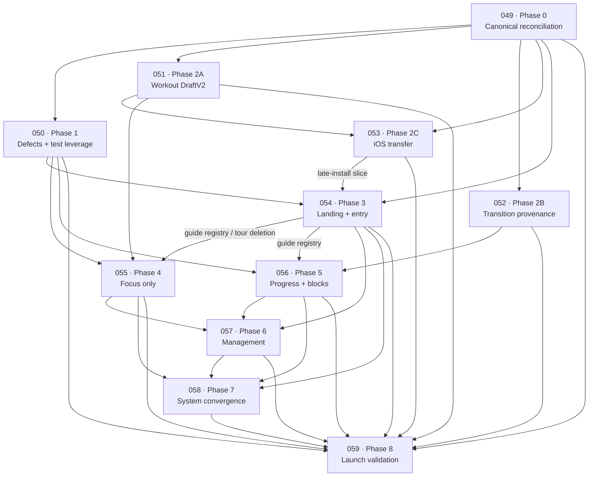

# Taurifer UI overhaul implementation sequence

## Initiative contract

This is the execution map for the owner-approved UI/UX overhaul in `docs/ui-audit.md`. It covers Plans 049–059 and phases 0–8. It does not reopen G-01–G-88, treat the four source audits as separate queues, or resume the deferred post-Wave-3 roadmap.

Planning baseline:

- `origin/main`: `09772f91b86549f71a5d845a7c74849569d592b6`
- audit baseline: `fe4bf52c`
- audit/current catalog: 72 screens / 221 frames
- drift after the audit baseline: only `docs/ui-audit.md` and its extraction/tool documentation; no app, CSS, test scenario, or catalog image drift
- current planning-time service-worker/script revision: `v175` (implementation always reads the live revision)

Phase 2 is deliberately split into three plans. Workout draft state, block-transition provenance, and temporary install transfer have different data-loss/security boundaries, test harnesses, deployment surfaces, and rollback paths. They can make useful progress independently, then close one Phase 2 gate together.

## Repository reconstruction evidence

The planning pass read the complete consolidated audit and its four evidence reports: `docs/ui-screen-audit-opus-taste.md`, `docs/taurifer-ui-audit-sol-design.md`, `docs/ui-screen-audit-sol-taste.md`, and `docs/ui-audit-opus-design.md`. It also inspected `plans/README.md`, the canonical backlog, all current ADRs, brand guide, Plans 047/048 and their governing program-entry/compiler/progression/shared-setup documents, old conflicting UI/List plans/specs, the complete catalog manifest/scenarios/tooling, browser/generative tests, and the live application modules.

The branch/PR review was refreshed on 2026-09-04. Open PRs #183 (PostHog deployment), #179 (exercise-library expansion), and the older UI drafts do not alter current main and are not prerequisites or alternate sources of product direction. PR #221 is this planning branch. Recent merged UI-affecting work was accounted for: #214 established the no-program state, #218 fixed scripted heading focus, and #220 refined onboarding/gender copy at the audit baseline. The consolidated audit and its tool are the only changes after that baseline.

Production-backed baseline checks passed before planning: Focus 116, History 40, program entry 287, install modes 348, accessibility 171, and session summary 45 assertions. `node tools/extract-ui-audit-findings.mjs --check` reported 72 screens, 221 frames, four source PRs, 32 findings, and 88 decisions; the catalog completeness check independently reported 72/221. These are current-state facts, not completion evidence for future plans.

## Plan inventory

| Plan | Phase | Name | Findings | Principal G decisions | Depends on | Complexity | Risk |
|---|---:|---|---|---|---|---|---|
| 049 | 0 | Canonical reconciliation | UI-01–UI-32 disposition only | G-01–G-88 disposition; transfer/recovery/system contracts | Planning PR approval | High | High |
| 050 | 1 | UI correctness and catalog leverage | UI-01–UI-07; UI-29 fixture | G-01, G-59, G-74 | 049 | Medium | Medium |
| 051 | 2A | Workout draft state foundation | Foundation beneath UI-18 | G-08, G-22, G-41–G-44, G-69, G-77, G-84 | 049; merge after 050 hotspot reconciliation | Very high | Very high |
| 052 | 2B | Block-transition provenance foundation | Foundation beneath UI-10 | G-24, G-31–G-36, G-53–G-56, G-61, G-70 | 049 | Very high | Very high |
| 053 | 2C | Temporary iOS install-transfer foundation | Foundation beneath UI-19 | G-07, G-39, G-48, G-71, G-84–G-88 | 049, 051 | Very high | Critical |
| 054 | 3 | Landing and program entry | UI-14 privacy; UI-15–UI-17; UI-19; UI-32 | G-09–G-10, G-17–G-21, G-25–G-26, G-37, G-39–G-40, G-46–G-52, G-72–G-73, G-79, G-81 | 049, 050; transfer slice 053 | Very high | High |
| 055 | 4 | Focus-only workout | UI-18, UI-23; Today preview adjacent to UI-25 | G-08, G-15, G-22, G-41–G-44, G-62, G-69 | 049, 050, 051; tour cleanup 054 | Very high | Very high |
| 056 | 5 | Progress and block lifecycle | UI-08–UI-12; UI-29 chart | G-11, G-24, G-27, G-29–G-36, G-53–G-56, G-60–G-61, G-70 | 049, 050, 052; cue slice 054 | Very high | Very high |
| 057 | 6 | Management surfaces | UI-13, UI-14 repair, UI-24–UI-28 | G-12–G-14, G-17, G-23–G-24, G-38, G-45–G-46, G-60, G-63–G-68, G-80 | 049, 050, 054, 055, 056 | Very high | High |
| 058 | 7 | Design-system convergence | UI-20–UI-22, UI-30 | G-13–G-14, G-28, G-57–G-60, G-67, G-74, G-80–G-81 | 049–057 principal surfaces | Very high | High |
| 059 | 8 | Public-launch UI validation | UI-04, UI-31; regression UI-01–UI-32 | G-01, G-05–G-06, G-59, G-74–G-76, G-83 | 049–058 and all owner gates | High | Critical |

## Dependency DAG

The DAG is acyclic. Edges labelled with a slice do not prevent independent earlier commits on the destination branch; they prevent that dependent slice and final merge.

## Critical path

The hard sequence is:

1. Plan 049 resolves canonical contracts, the service/provider/privacy boundary, and the recovery-week owner rule.
2. Plans 050, 051, and 052 branch from the reconciled contract. They may develop concurrently, but shared shell/cache work merges in the order 050 → 051 → 052 unless a PR has no overlapping files.
3. Plan 053 consumes DraftV2 and closes the install-transfer foundation. Service-only work may start earlier, but client import cannot.
4. Plan 054 consumes the corrected catalog harness and transfer. Its landing visual slice stops for owner selection.
5. Plan 055 consumes DraftV2 and the contextual-guide registry before removing List/tour artifacts. Core Focus work can overlap Plan 054; deletion/merge cannot bypass it.
6. Plan 056 consumes transition provenance and the guide registry. It stops its recovery slice until the exact policy is owner-approved.
7. Plan 057 consumes the stabilized entry/privacy, workout, and Progress outcome contracts.
8. Plan 058 migrates every public surface after Plans 054–057 stop changing principal structure.
9. Plan 059 validates one immutable release-candidate SHA, then waits for physical-device and final owner sign-off.

The longest likely path is 049 → 051 → 053 → 054 → 055 integration → 057 → 058 → 059. The recovery owner gate creates a second hard path: 049 → 052 → 056 → 057 → 058 → 059.

## Parallelism and merge constraints

| Plan | Can start immediately after planning approval? | Safe parallel work | Cannot merge before | Shared hotspots / conflict risk |
|---|---|---|---|---|
| 049 | Yes | None; it is the contract root | Owner architecture/recovery decisions are recorded or explicitly block only their slices | Backlog, plan index, ADRs, brand/privacy/state specs; high doc conflict |
| 050 | No; after 049 | 051 pure model; 052 pure model | 049 | `app.js`, CSS, i18n, catalog tools/manifest, SW; high with all UI plans |
| 051 | No; after 049 | 050 UI checks; 052 transition model; 053 service fixtures | 049 and reconciliation with merged 050 hotspots | `app.js`, `index.html`, SW, draft/race/focus tests; very high with 055 |
| 052 | No; after 049 | 050/051; 053 service | 049; recovery slice also owner rule | compiler/adapter, `app.js`, SW, storage/backup tests; high with 056 |
| 053 | Service-only scaffolding after 049; client later | 050/052; service contract beside 051 | 051, provider/privacy gate, staging/device evidence | `app.js`, telemetry, i18n, SW, install/shared tests; critical with 054 |
| 054 | Visual-direction preparation after 049/050 | 055 workout-owned and 056 Progress-owned code | 050; transfer slice 053; imagegen owner selection | shell, entry modules, i18n, SW, manifest; high |
| 055 | Core after 051 | 054 entry and 056 Progress with file partition | 051; tour deletion after 054 registry | workout portions of app/index/CSS, i18n, SW, catalog; very high |
| 056 | Core after 052/050 | 054 entry and 055 workout with file partition | 052; cues after 054; recovery after owner rule | Progress/Program portions, compiler adapter, i18n, SW, manifest; very high |
| 057 | No | History and Share investigation/tests may be prepared, but one branch/integrator owns shared files | 054, 055, 056 | Almost every monolithic UI file; very high |
| 058 | Inventory/checker can prepare against a pinned snapshot | Automated inventory preparation only | Principal UI plans 054–057 | Entire public CSS/markup/catalog; serialize all visual work |
| 059 | No | Catalog, accessibility, and privacy checks can run concurrently against the same immutable SHA | 049–058 and all gates | Evidence manifest is single-writer; any source fix invalidates evidence |

Parallel plans never copy unpublished files, cherry-pick arbitrary sibling work, or redefine another plan's contract. Before a dependent merge: fetch, explicitly merge `origin/main`, resolve shared hotspots, rerun focused and broad verification, push, and update the PR. Published branches are never rebased.

## File ownership and integration matrix

| File/module | Contract owner | Ordered consumers/editors | Serialization rule |
|---|---|---|---|
| `docs/ui-audit.md` decision register/companion | 049 | 059 verifies | Audit findings remain authoritative; do not edit product meaning |
| `docs/backlog.md`, ADRs, brand/privacy/current specs | 049 | 054–059 verify/consume | Phase 0 merges before code; later doc corrections cite owner plan |
| `app.js` persistence/draft region | 051 | 053 import, 055 workout | 051 → 053 → 055; transition storage region from 052 merges before 056 |
| `app.js` entry/install region | 054 | 053 primitive first; 057 Settings links | 053 → 054 → 057 |
| `app.js` Progress/block region | 052 domain/commit boundary, 056 UI | 057 summary/Program consumers, 058 annotations | 052 → 056 → 057 → 058 |
| `app.js` History/Share/Summary/Today/Program/Settings | 057 | 058 presentation annotations | Wait for 054–056, then 057 → 058 |
| `workout-draft.js` (new) | 051 | 053 logical clone, 055 UI | Consumers do not add fields; schema changes return to 051 contract |
| `program-transition.js` (new) | 052 | 056 | 056 renders/commits proposals only; it does not modify derivation |
| `progress-model.js` (new) | 056 | 057 summary/Today, 059 tests | Outcome/scope changes remain owned by 056 |
| `install-transfer.js` / `services/install-transfer/**` | 053 | 054 promotion, 059 validation | 054 never changes claim/import semantics; service isolated from root deps |
| `program-compiler.js` | 052 for transition resolver | 054 reads candidate facts; 056 invokes resolver | No UI plan edits compiler output to fabricate a fit |
| `program-entry.js`, `program-entry-adapter.js`, `program-editor.js` | 054 for entry UX | 052/056 transition adapter boundary; 057 repair routes | Compiler/provenance first, entry UI second, guided/repair consumers last |
| `shared-setup.js` | Existing ADR 0007 contract; 057 owns blocker reporting | 053 cookie coexistence; 054 adaptive landing | 053 does not change setup payload; 054 keeps no-persist; 057 adds exact repair |
| `index.html` | Surface plan for its region | 050 fixes → 054 entry → 055 workout → 056 Progress → 057 management → 058 roles | Merge/rebase main at every phase; no long-lived duplicate shell |
| `styles.css` | 049 roles, 058 final system | 050 defects → 054 entry → 055 workout → 056 Progress → 057 management | Feature plans consume named roles; 058 performs final whole-file migration |
| `i18n-en.json`, `i18n-pt.json`, generated `i18n.js` | Each surface plan owns its keys; build tool owns output | 050 → 054 → 055 → 056 → 057; 058 only approved redundant labels | Always merge sources, regenerate once, never hand-merge generated output |
| `telemetry.js` / schema | 049 policy; 053 identity/transfer | 054–057 coarse task events; 059 freezes | Each event enters allowlist before merge; 059 rejects unapproved fields |
| `sw.js` and five protected script query revisions | Current merging plan | Every cached-file plan | Read live cache; one increment per merged coherent shell; all lockstep tests pass |
| `docs/ui-screens/manifest.json`, scenarios, PNGs | 050 harness/matrix | 053–057 state owners; 058 full migration; 059 final evidence | Each owner regenerates full catalog after merging main; never hand-edit PNGs |
| `test/**` shared browser helpers | 050 validation primitives | State/surface owners, then 059 | Preserve generic helpers; feature-specific facts live with owning suite |
| `assets/exercises/**`, exercise generator/curation | No overhaul plan | 059 verifies only | Closed licensed set; no additions/recolors/placeholders |

## Phase gates

| Phase | Closure gate across split plans |
|---|---|
| 0 | No current governing contradiction; every G/UI item owned; transfer/recovery/system contracts executable; all child plans complete |
| 1 | Verified defects fixed; risk matrix/copy/overflow gates green; full catalog regenerated |
| 2 | No hidden DOM state; transitions and transfer are versioned/atomic/recoverable; full crash/retry/expiry/duplicate/two-tab/backup/divergence matrix passes |
| 3 | Owner-selected landing reference; all entry routes activate explicitly; shared no-persist and install transfer correct; Privacy/guides work |
| 4 | Every parity row green; Focus sole logger; List artifacts gone; real-phone workout gate passes |
| 5 | Every scope/label truthful; insufficient evidence neutral; structural actions exact/provenanced/confirmed/atomic; recovery bounded |
| 6 | Destructive/share/edit boundaries safe; management hierarchy responsive/accessibility-complete |
| 7 | Every public role/exception inventoried; no one-off/tunnel; rendered-role AA and full catalog pass |
| 8 | Same-SHA automated/catalog/physical/privacy evidence complete and owner signs off |

## Owner gates

| Gate | First plan | Blocks | Evidence required |
|---|---|---|---|
| Install-transfer provider/region/key/operations ownership and privacy disclosure | 049 | Transfer implementation in 053 and established-data offer in 054 | ADR/spec names provider, residency, key/deletion/incident owner, expiry monitor, kill switch, approved copy |
| Recovery-week deterministic allocation/rounding/primary-pattern rule | 049 | Recovery slice in 052/056 | Representative family outputs and invariant proofs; owner-selected version recorded |
| Landing mini-interface direction | 054 | Production landing preview asset/markup | Three+ equal-content imagegen directions; prompt/hash; explicit owner selection |
| Phase phone reviews | 053–057 | Respective plan completion | Recorded real-device behavior for transfer, entry, Focus, Progress, management |
| System continuity board | 058 | Removal of compatibility aliases / Phase 7 closure | All surface groups in light/dark and compact/PT+200; owner approval |
| Physical iOS acceptance | 059 | Public-launch gate | Safari + installed PWA + VoiceOver critical journeys and safe-area/scroll evidence |
| Physical Android acceptance | 059 | Public-launch gate | Chrome + installed PWA + TalkBack critical journeys and safe-area/scroll evidence |
| Final release sign-off | 059 | Merge/release authorization | Complete evidence manifest, catalog, telemetry/privacy and limitations against one SHA |

Implementation agents stop at a gate. They do not choose for the owner, infer approval, or continue the dependent slice. Independent slices may continue until their first dependency boundary.

## UI finding disposition

| Finding | Owner plan | Disposition |
|---|---|---|
| UI-01 | 050 | Map raw day/equipment identifiers; rendered key detector |
| UI-02 | 050 | Complete EN/PT messages; no grammar fragments |
| UI-03 | 050 | Reflow fixed controls; do not shrink type |
| UI-04 | 050, verified 059 | Risk matrix and every-state overflow gate |
| UI-05 | 050 | Non-overlapping filter scroller with continuation cue |
| UI-06 | 050 | Real Program editor label row across variants |
| UI-07 | 050 | Canonical disabled-primary hierarchy |
| UI-08 | 056 | Mobile summary rows/drill-in; tables secondary/cued |
| UI-09 | 056 | Week status separated from actionable program evidence; baseline neutral |
| UI-10 | 052 foundation, 056 UI | Unified Review, exact safe transitions and bounded recovery |
| UI-11 | 056 | Overview/Review primary; Evidence secondary |
| UI-12 | 056 contract, 057 consumers | Outcome/action vocabulary and locale date roles |
| UI-13 | 057 | History read-first, calendar replacement, explicit stale-safe edit/delete |
| UI-14 | 054 Privacy; 057 Share repair | Cached disclosure; complete fail-closed in-context repair |
| UI-15 | 054 | Visible responsive expert controls and 2×2 muscle groups |
| UI-16 | 054 | Five-job hierarchy; merged recommendation/editor; explicit activation |
| UI-17 | 054 | Browse scan facts from canonical metadata |
| UI-18 | 051 foundation, 055 UI | DraftV2 removes hidden state; capability parity then List deletion |
| UI-19 | 053 primitive, 054 promotion/guides | Platform/milestone install, safe late transfer, no global tour |
| UI-20 | 049 roles, 058 migration | Bounded elevation, mostly flat content, no tunnels |
| UI-21 | 049 roles, 058 migration | Shared semantic controls with justified variants |
| UI-22 | 049 roles, 058 migration | Bounded Sans/Mono, radius, label, progress system |
| UI-23 | 055 | Content-driven Focus spacing and stable timer/title geometry |
| UI-24 | 057 | Preserve summary hierarchy; semantic outcomes; ranked weighted counts |
| UI-25 | 055 Preview; 057 finding owner | Read-only Preview; one weekly line plus block position |
| UI-26 | 057 | Distinct Program action roles, nonzero readiness route, shallow dock |
| UI-27 | 057 | Four Settings task groups, Privacy route, replayable guides |
| UI-28 | 055 geometry/function; 057 visual semantics | Orange timer progress, neutral controls, normalized glyphs |
| UI-29 | 050 fixture; 056 chart | Credible load fixture; 1/2/3+ evidence policy |
| UI-30 | 058, verified 059 | Rendered-role WCAG audit; no blanket orange swap |
| UI-31 | 059 | Actual scroll end plus physical browser/PWA/AT evidence |
| UI-32 | 054 | Product-explaining landing, early action, selected preview, abandoned behavior |

## G-decision disposition

| Decision | Owner/consumer | Disposition |
|---|---|---|
| G-01 | 049, 050, 059 | Release-standard defects and final evidence |
| G-02 | 049, 058, 059 | Whole-product public-launch polish, not partial cleanup |
| G-03 | 049, 054–058 | Preserve core/identity; redesign approved weak surfaces |
| G-04 | 049 | Backlog priority becomes UI overhaul before alpha/post-Wave-3 work |
| G-05 | 049, sequence, 059 | Gated phases with independent completion evidence |
| G-06 | 059 | Automated/task/device evidence; owner decides |
| G-07 | 049, 053 | Static/local-first default with one approved transfer exception |
| G-08 | 051, 055 | Preserve workout contracts while changing justified workflow |
| G-09 | 054 | First-run becomes product landing |
| G-10 | 054 | Preserve all five entry jobs |
| G-11 | 056 | Progress hybrid decision guide/evidence record |
| G-12 | 057 | History read first, explicit in-place edit |
| G-13 | 049, 057, 058 | Bounded semantic elevation |
| G-14 | 049, 057, 058 | Shared semantics with contextual variants |
| G-15 | 055 | Focus-led, resolved to Focus-only by G-22 |
| G-16 | 049, 054 | Historical split resolved by G-39/G-40 install/guidance contracts |
| G-17 | 049, 054, 057 | Task-only Share; separate cached Privacy |
| G-18 | 054 | Approved first-run proposition/explanation |
| G-19 | 054 | Product-led program → set → target preview |
| G-20 | 054 | Early Start training opens chooser |
| G-21 | 054 | One short ethos line |
| G-22 | 051, 055 | Focus sole logger after state migration |
| G-23 | 057 | Selected History session replaces calendar |
| G-24 | 052, 056, 057 | Outcomes and recommendations are separate vocabularies |
| G-25 | 054 | Expert configuration remains visible |
| G-26 | 054 | Browse scan-first canonical facts |
| G-27 | 056 | Snapshot/comparison/trend by evidence count |
| G-28 | 049, 058 | Complete design-system migration before launch |
| G-29 | 056 | Two-level Progress navigation |
| G-30 | 056 | Separate weekly status and program action queue |
| G-31 | 052, 056 | Insufficient evidence is neutral baseline |
| G-32 | 056 | Unified Review/End block with active read-only state |
| G-33 | 052, 056 | Faithful previewed/confirmed structural changes |
| G-34 | 056 | Strength current block default; explicit all history |
| G-35 | 056 | Volume this week/block-to-date against matching plan periods |
| G-36 | 056 | Mobile summaries/drill-in |
| G-37 | 054 | Adaptive shared landing and direct Start this program |
| G-38 | 054, 056, 057 | Locale long/short/native date roles |
| G-39 | 053, 054 | Platform-sensitive install timing and transfer |
| G-40 | 054, consumed 055–057 | Contextual guidance replaces modal tour |
| G-41 | 051, 055 | Flexible exercise navigation/reorder; ordered sets |
| G-42 | 051, 055 | Session versus exercise action ownership |
| G-43 | 051, 055 | Immersive workout and safe draft-preserving Leave |
| G-44 | 055 | Read-only Today session preview |
| G-45 | 057 | Complete per-row Share repair |
| G-46 | 049, 054, 057 | Cached Privacy linked from landing/Settings, not Share |
| G-47 | 054 | Landing once; later no-program app |
| G-48 | 053, 054 | Persistent non-blocking install pressure |
| G-49 | 054 registry, 055–057 anchors | Action-linked cues |
| G-50 | 054 | Recommend-primary five-job hierarchy |
| G-51 | 054 owner gate | Imagegen directions before owner selection/asset |
| G-52 | 050, 054 | Visible 2×2 muscle choices with enlarged-text resilience |
| G-53 | 052, 056 | Diagnose fewer days versus long sessions |
| G-54 | 052, 056 | Separate protected permanent volume reduction |
| G-55 | 049, 052, 056 | Volume-only week-one recovery, canonical week two |
| G-56 | 049, 052, 056 | Stagnation/decline plus corroboration |
| G-57 | 049, 058 | Plex Sans/Mono jobs and bounded scale |
| G-58 | 049, 058, 059 | Preserve paper backgrounds in dark |
| G-59 | 050, 059 | Risk-based language/text matrix and every-state overflow |
| G-60 | 056, 057, 058 | Restrained semantic outcomes with words/icons |
| G-61 | 052, 056 | Exact-program guided manual repair fallback |
| G-62 | 054, 055–057 | Complete/dismiss once; Settings replay |
| G-63 | 057 | Ranked weighted hard-set counts, no bars |
| G-64 | 057 | Block position plus one weekly line |
| G-65 | 057 | Hide zero readiness; nonzero navigates |
| G-66 | 057 | Settings task groups |
| G-67 | 055, 057, 058 | Orange live timer progress; neutral controls |
| G-68 | 057 | History Save/Cancel and isolated Delete |
| G-69 | 054 registry, 055–057 anchors | Lifecycle guide coverage |
| G-70 | 049, 052, 056 | Approximately half sets, optional first, cross minSets, retain primary work |
| G-71 | 049, 053, 054 | One-hour backend transfer and atomic import |
| G-72 | 054 | First/first save/third/monthly install cadence |
| G-73 | 054 | Remove complete ethos passage |
| G-74 | 049, 050, 058, 059 | WCAG 2.2 AA by actual rendered role |
| G-75 | 059 | Automated plus physical browser/PWA/AT gates |
| G-76 | 059 | Owner-only prelaunch evaluation; no representative lifters |
| G-77 | Sequence | Foundations-first implementation order |
| G-78 | Plans 049–059 | Umbrella with bounded, takeover-ready child plans |
| G-79 | 054 | Merge recommendation result/editable preview |
| G-80 | 057, 058 | Shallow persistent Program action layer |
| G-81 | 054, 058 | Landing uses normal Taurifer system |
| G-82 | 049, 054 | Creator identity explicitly deferred; no implementation |
| G-83 | 049, 053–057, 059 | Allowlisted privacy-preserving telemetry; owner interpretation |
| G-84 | 049, 051, 053 | Exact logical clone and explicit exclusions |
| G-85 | 049, 053, 059 | One-hour clone lifetime: deletion on verified import (commit), never on claim; unclaimed records expire at ≤60 minutes |
| G-86 | 049, 053, 054 | Explicit informed install-and-transfer action |
| G-87 | 049, 053, 059 | Preserve telemetry identity; browser/standalone context |
| G-88 | 049, 053, 054, 059 | Safari recovery snapshot and divergence warning |

## Rejected and closed source-audit claims

The following are guardrails, not backlog items:

- do not darken licensed exercise-art paper or fill empty media tiles;
- do not merge Recommend and Custom;
- do not treat every English exercise/user/shared name on PT-BR as a leak;
- do not re-fix scripted heading focus already fixed in `0c807118`;
- do not globally replace orange or indiscriminately strengthen dark secondary text;
- do not add creator avatars/trust metadata;
- do not create/propagate a separate landing motif;
- do not ban middle dots globally;
- do not restore the Program dock's old flatness instead of applying G-80;
- do not preserve List merely because earlier Plan 013 did;
- do not infer a dock-occlusion bug from a non-terminal screenshot.

Plan 059's disposition check must fail if these reappear as requirements.

## Catalog impact by phase

Exact counts are computed against the live manifest in each PR because the selected landing direction and final reachable state inventory cannot be pre-counted truthfully. Each plan records before/after states and frames.

| Phase/plan | Expected additions | Expected removals | Expected changed states / matrix |
|---|---|---|---|
| 0 / 049 | None | None | No visual/catalog change |
| 1 / 050 | No semantic product states | None | Build/Custom/Recommend/Library/Program/fixture states; +PT normal to current standard set and +PT+200 demanding set; every variant gets overflow/copy evidence |
| 2A / 051 | Stale/invalid draft recovery only if public | None | List/Focus should remain visually equivalent; integrity semantic evidence |
| 2B / 052 | None | None | No final Progress states; transition hooks only |
| 2C / 053 | Transfer explanation/ready/import/success/error/recovery/divergence | None | iOS sheet/eligible Settings hook; EN/PT/theme/compact/200%/installed contexts |
| 3 / 054 | Generic/adaptive landing, merged alternative, Browse summaries, cues/replay, Privacy/install milestones | Old Milo/full-passage form; separate recommendation result/preview; global tour after replacements | All entry/shared/install states, demanding PT+200 and reduced motion |
| 4 / 055 | Today Preview, Session/exercise sheets, map/reorder/Leave/recovery states | Workout List and mode-switch states; List tour/copy/tests | Focus/timer/note/Why/Today/summary transition; full phone/text/theme/motion matrix |
| 5 / 056 | Baseline/action Overview; active/final Review; diagnosis/diffs/guided/volume/recovery; 0/1/2/3+ Evidence | Separate end-block dialog; five-equal-tab and primary wide-table states | Every Progress and Program Review entry; PT+200 transitions/evidence |
| 6 / 057 | History read/edit/delete conflict; Share blockers/repair; summary outcome variants; Program readiness; guide replay | Edit-on-open History; Share disclosure; relative muscle bars | History/Share/Summary/Today/Program/Settings/timer; destructive/scroll matrix |
| 7 / 058 | Only genuinely missing public states | Stale states already made unreachable | Every live public frame reviewed/migrated; role/contrast semantic evidence |
| 8 / 059 | Only reachable gaps found by completeness audit | Only obsolete/unreachable catalog entries with disposition | Complete catalog regenerated; final risk matrix, installed/browser, scroll-end and same-SHA evidence |

## Documentation reconciliation assigned to Plan 049

Plan 049, not this planning PR, implements current-document changes:

- `docs/backlog.md`: make the overhaul the active initiative; Focus/Progress/landing are no longer evidence-only; retain unrelated roadmap items as deferred.
- `plans/README.md`: register execution state and mark conflicting old plans/specs historical/superseded in part without erasing them.
- ADR 0005: supersede old install timing/no-late-transfer scope.
- ADR 0006: supersede full Milo/poem landing while preserving identity elsewhere.
- ADR 0007: preserve setup-link/cookie/confirmation; move disclosure from Share and distinguish the separate transfer token/service.
- ADR 0009: reaffirm token-swap dark and paper-backed art.
- ADR 0010: make the owner-approved overhaul current while preserving commercialization/platform gates.
- Plans 047–048/program-entry docs: merge recommendation result/preview and update landing/install/guides while retaining compiler/candidate/activation provenance.
- progression/compiler docs: recovery is a separate explicit schedule policy, not an automatic strategy/re-entry formula.
- brand guide: landing proposition/visual gate, bounded elevation, role system, privacy/install claims, rendered-role accessibility; retain palette/type/art.
- `AGENTS.md`, Privacy/data claims, old visual-only/dual-workout/List specs and Plan 013: qualify transfer exception and mark obsolete contracts historically.
- screen-catalog/tooling docs: risk matrix, overflow/semantic/contrast/physical evidence.

No historical rationale is deleted. Superseding ADR/status links identify the newer scope and date.

## Architectural prerequisites

### Workout truth

Plan 051's DraftV2 is the only active-session truth. Stable exercise/set identity, programmed versus edited values, completion/uncommit, skip/restore, repeat-last, substitution, warm-up, notes/session metadata, revisioned persistence, stale-tab rejection, reload/crash/save semantics exist before Plan 055 deletes List.

### Transition truth

Plan 052 creates immutable, hashed proposals and transition-in/out provenance. Sibling recompilation, guided repair, permanent reduction, and recovery preserve compiler/program/progression/exercise/archive/version identity. Preview and confirmation commit the same proposal atomically.

### Install transfer

Plan 053 implements one isolated service and logical-clone/import marker. It has token entropy/digest lookup, AEAD, one claimant with bound retry, immediate/one-hour deletion, strict privacy/logging, source retention, installed atomic import, recovery snapshot/divergence, and operational kill switch. It is not sync.

### Design roles

Plan 049 names semantic roles before feature work. Plan 058 inventories and migrates the entire public surface only after product structures settle, then Plan 059 measures actual rendered roles.

## Deferred work

The following remain outside Plans 049–059 except a future-compatible seam explicitly named in a current plan: general program lifecycle expansion, general lifecycle/friction observability, publisher attribution/identity, free one-off sessions, general multi-gym, generalized intervention routing, Pro, payments, entitlement, AI, cloud sync, production account/platform APIs, hosted workout storage, creator publishing, and native rewrite. None may be pulled into an overhaul PR to “complete” a surface.

## Public-launch boundary

Phase 8 is the only final release-quality gate. Earlier plan completion means its bounded implementation is ready for owner review, not that Taurifer may launch. Plan 059 must bind automation, catalog, device, privacy, telemetry, service-worker, and documentation evidence to one candidate SHA. Any relevant fix changes the candidate and invalidates affected evidence. The owner alone signs off and separately authorizes merge/release.

## Takeover-ready invariant

Every Plan 049–059 file contains its own recommended branch/worktree/base/dependency/file ownership, draft-PR-before-work rule, full PR body template, exact atomic commit rows with proof/regression/catalog/rollback, push-after-each-slice discipline, stable-history rule, STOP conditions, recovery/rollback, clean-worktree check, owner-review boundary, and exact completion gate.

At every pushed boundary, a replacement agent with only the remote branch and PR must be able to run the first `Next exact steps` item. No handoff depends on a stash, local-only file, rewritten SHA, or this conversation.
